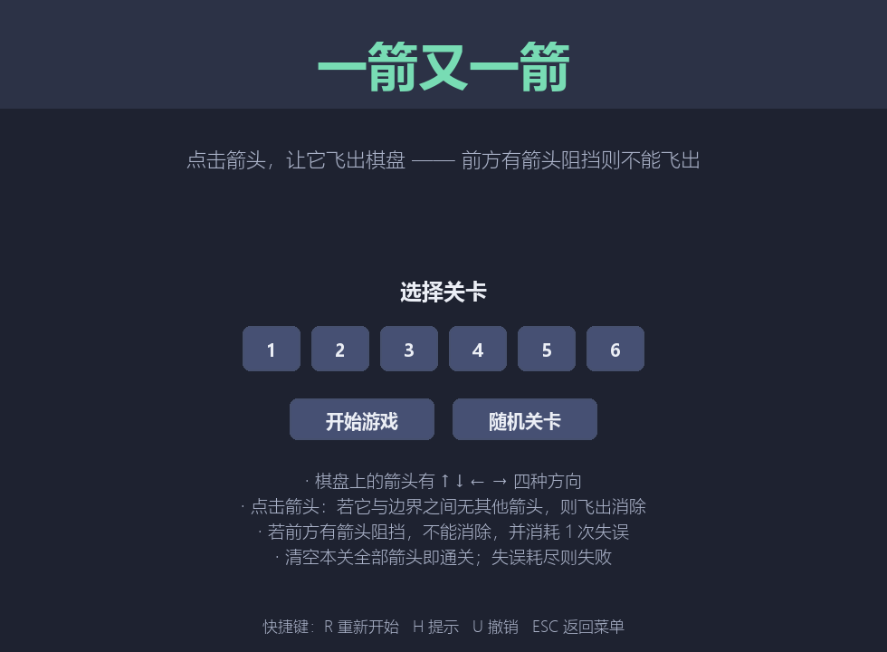
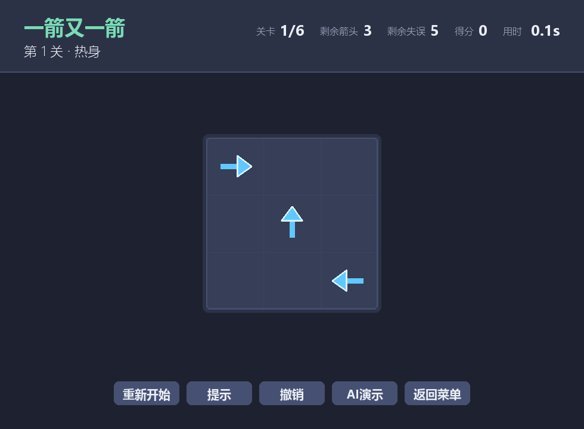
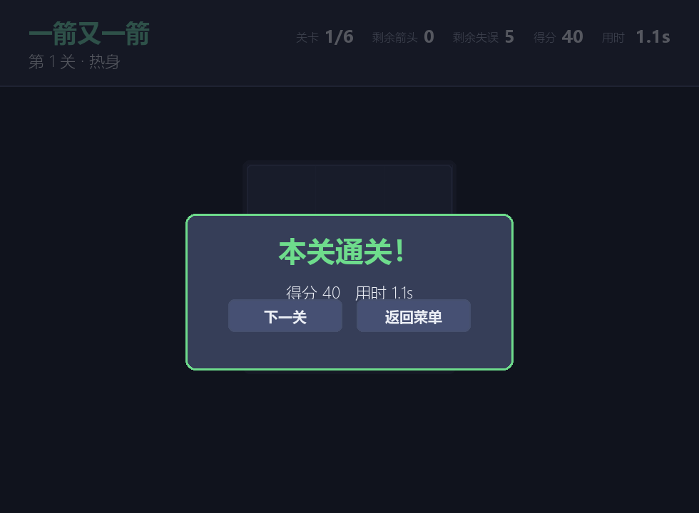
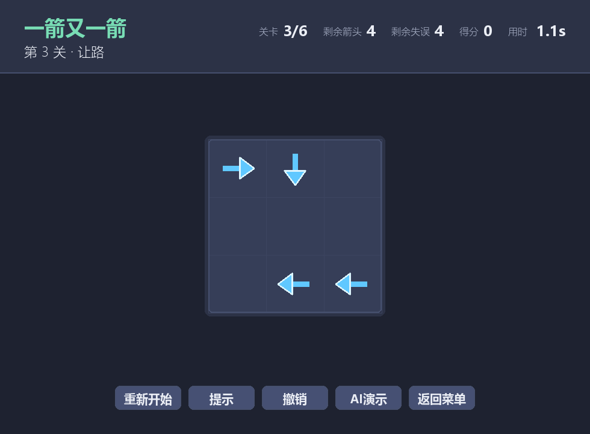
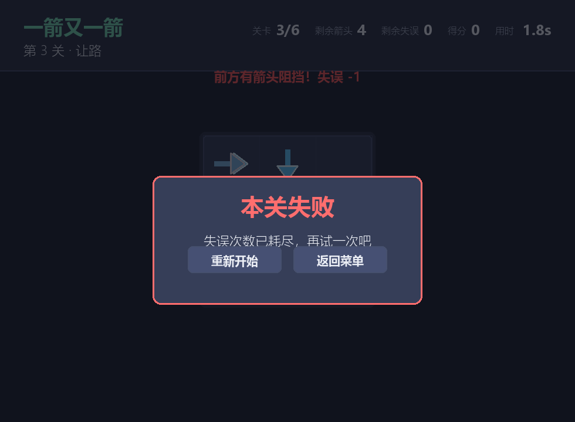

# 一箭又一箭 · Arrow After Arrow

一个用 Python + Pygame 开发的“一箭又一箭”风格网格消除小游戏。点击箭头，若它前进方向上直到棋盘边界都没有其他箭头阻挡，它就会飞出棋盘并被消除；否则发生碰撞并消耗一次失误机会。清空本关全部箭头即可进入下一关，失误次数耗尽则本关失败。

> 本项目为课程作业，仅参考《一箭又一箭》的核心玩法，未使用原游戏的任何素材、代码或关卡。所有代码、关卡、音效均由本人借助 AIGC 工具辅助完成并自行理解与调试。

---

## 游戏简介

- **棋盘**：网格化布局，每格至多一个箭头，方向为上 `^`、下 `v`、左 `<`、右 `>`。
- **核心规则**：点击箭头后，程序检查该箭头前进方向上、到棋盘边界之间是否还有其他箭头。
  - 无阻挡 → 箭头飞出棋盘并消失，得分 +10。
  - 有阻挡 → 箭头不消失，发生晃动 + 变红碰撞反馈，失误次数 −1。
- **通关**：清空当前关卡全部箭头 → 进入下一关。
- **失败**：失误次数耗尽 → 本关失败，可重新开始。
- **关卡**：内置 6 个手工设计、已验证可通关的关卡（由易到难），另可一键生成保证可通关的随机关卡。

### 扩展功能

- 得分系统（含剩余失误奖励）
- 计时
- 提示功能（高亮一个当前可飞出的箭头）
- 撤销上一步
- 随机生成可通关关卡（反向构造法，保证有解）
- AI 自动求解演示
- 程序内合成音效（无需外部音频文件）

---

## 开发环境

| 项目 | 版本 |
|------|------|
| 操作系统 | Windows 10 / 11 |
| Python | 3.10+（开发与测试使用 3.14.7） |
| Pygame | pygame-ce 2.5.8（社区版，兼容 Python 3.14） |
| NumPy | 2.5.3（用于程序内合成音效） |

> 说明：官方 `pygame` 在 Python 3.14 上暂无预编译 wheel，本项目改用社区版 `pygame-ce`，API 完全兼容。

---

## 安装和运行

### 1. 克隆仓库

```bash
git clone https://github.com/<你的用户名>/arrow-after-arrow.git
cd arrow-after-arrow
```

### 2. 创建虚拟环境（推荐）

```bash
py -m venv .venv
.venv\Scripts\activate     # Windows
# source .venv/bin/activate  # macOS / Linux
```

### 3. 安装依赖

```bash
pip install -r requirements.txt
```

`requirements.txt` 内容：

```
pygame-ce>=2.5
numpy>=1.24
```

### 4. 运行游戏

```bash
py main.py
```

### 5. 运行测试

```bash
py -m unittest tests.test_core -v
```

---

## 游戏操作说明

| 操作 | 说明 |
|------|------|
| 鼠标左键点击箭头 | 尝试让该箭头飞出棋盘 |
| `R` 键 / 点击「重新开始」按钮 | 重置当前关卡到初始状态 |
| `H` 键 | 提示：高亮一个当前可飞出的箭头 |
| `Z` 键 | 撤销上一次成功消除 |
| `N` 键 | 通关后进入下一关 |
| `Space` / `Enter` 键 | 开始界面开始游戏；通关/失败界面继续 |
| `Esc` 键 | 返回开始界面 |
| `M` 键 | 静音/取消静音 |

### 界面一览

- **开始界面**：游戏标题、开始游戏、随机关卡、退出按钮。
- **游戏界面**：当前关卡名、棋盘、剩余箭头数、剩余失误数、得分、计时、重新开始 / 提示 / 撤销 / 菜单按钮。
- **通关界面**：本关得分、用时、「下一关」按钮。
- **失败界面**：失误次数耗尽提示、「重新开始」按钮。
- **全部通关界面**：总得分、总用时、回到菜单。

---

## 游戏截图

### 开始界面



### 游戏中



### 通关



### 第 3 关（更大棋盘）



### 失败



---

## 项目结构

```
arrow-after-arrow/
├── main.py                 # 主程序：游戏循环、动画、界面、输入
├── ui.py                   # 绘制工具：颜色、字体、箭头/棋盘/HUD/按钮绘制
├── sound.py                # 程序内合成音效（NumPy）
├── make_screenshots.py     # 生成 README 截图（无头渲染）
├── requirements.txt        # 依赖
├── README.md               # 项目说明（本文件）
├── AIGC_LOG.md             # AIGC 使用过程记录
├── BLOG_DRAFT.md           # 博客草稿（含 PSP 表格、测试结果、心得）
├── core/                   # 纯逻辑层（不依赖图形库，便于单元测试）
│   ├── __init__.py
│   ├── board.py            # Arrow / Board / Direction / 路径检测 / 求解器
│   ├── levels.py           # 手工关卡 + 随机关卡生成器
│   └── game.py             # Game 状态机（开始/游戏/通关/失败）
├── tests/
│   ├── __init__.py
│   └── test_core.py        # T01–T06 单元测试 + 求解器/关卡校验
└── assets/                 # 截图
    ├── start.png
    ├── playing.png
    ├── level_complete.png
    ├── playing_level3.png
    └── failed.png
```

---

## 实现思路

### 数据表示

- **方向**：`Direction` 枚举（UP/DOWN/LEFT/RIGHT），每个方向带 `(d_row, d_col)` 单位向量。
- **箭头**：`Arrow` 不可变 dataclass，含 `(row, col, direction)`。
- **棋盘**：`Board` 内部用 `dict[(row, col)] -> Arrow` 存储，查询/删除均为 O(1)。
- **关卡**：用字符串地图直观书写（`.` 空格、`^` 上、`v` 下、`<` 左、`>` 右），由 `parse_map` 解析。

### 路径检测（核心）

`Board.path_cells(arrow)` 返回箭头前进方向上、到边界为止的所有格子（不含自身）；`path_blocked` 判断这些格子中是否存在其他箭头。以朝右为例：

```python
def path_cells(self, arrow):
    r, c = arrow.row, arrow.col
    d = arrow.direction
    if d == Direction.RIGHT:
        return [(r, cc) for cc in range(c + 1, self.cols)]
    # ... 其余三向类似
```

### 可通关性保证

一个关键性质：**删除箭头只会解除阻挡，不会让原本可飞出的箭头变得被阻挡**。因此只要初始棋盘可通关，任意合法消除序列后剩余棋盘仍可通关——玩家不会陷入“有箭头却谁都飞不出去”的死局。

- `is_solvable` / `find_solution`：回溯 + 状态记忆化求解，用于加载时校验关卡、提示功能、AI 自动求解。
- `random_solvable_level`：**反向构造**——从空棋盘起不断放入“相对当前已放箭头可飞出”的箭头，放置顺序的逆序即合法消除顺序，从而保证生成的随机关卡一定可通关。

### 界面与动画

- `ui.py` 提供绘制工具函数，`main.py` 负责主循环与状态切换。
- 飞出动画：箭头沿方向滑出边界并淡出。
- 碰撞动画：箭头原位晃动 + 变红闪烁。
- 音效：用 NumPy 合成正弦/衰减波，无需外部音频文件；音频设备不可用时自动静音。

---

## 测试

共 11 个单元测试，覆盖作业测试表 T01–T06 及路径检测、求解器、关卡可通关性：

| 编号 | 测试内容 | 预期结果 | 实际结果 |
|------|----------|----------|----------|
| T01 | 点击前方无阻挡的箭头 | 箭头飞出棋盘并消失 | ✅ 通过 |
| T02 | 点击前方有阻挡的箭头 | 箭头不消失，失误次数减 1 | ✅ 通过 |
| T03 | 点击位于边缘且朝向棋盘外的箭头 | 正常消失，不发生越界错误 | ✅ 通过 |
| T04 | 消除本关全部箭头 | 显示通关并进入下一关 | ✅ 通过 |
| T05 | 失误次数耗尽 | 显示失败并允许重新开始 | ✅ 通过 |
| T06 | 游戏中重新开始 | 箭头布局和失误次数恢复 | ✅ 通过 |

运行测试：

```bash
py -m unittest tests.test_core -v
```

输出示例：

```
test_T01_fly_out_when_unblocked ... ok
test_T02_blocked_consumes_mistake ... ok
test_T03_edge_arrow_no_out_of_bounds ... ok
test_T04_clear_all_advances_level ... ok
test_T05_mistakes_exhausted_fails_and_restart ... ok
test_T06_restart_restores_state ... ok
test_all_four_directions ... ok
test_right_blocked ... ok
test_right_free_at_edge ... ok
test_all_levels_solvable ... ok
test_random_level_solvable ... ok
----------------------------------------------------------------------
Ran 11 tests in 0.002s
OK
```

---

## AIGC 使用说明

开发过程中使用了 AIGC 工具（CodeArts / GLM-5.2）辅助完成以下工作：

- 学习 pygame-ce 在 Python 3.14 上的安装与兼容性处理
- 设计 `Board` / `Arrow` / `Direction` 的数据结构与路径检测代码
- 设计 6 个手工关卡并用回溯求解器验证可通关性
- 编写飞出 / 碰撞动画与界面绘制代码
- 编写随机关卡反向构造生成器
- 编写并调试单元测试
- 生成 README、AIGC 日志、博客草稿

详细的 3 次以上代表性 AI 协作过程见 [AIGC_LOG.md](AIGC_LOG.md)。

---

## 许可与致谢

- 本项目为课程作业，仅供学习使用。
- 未使用任何商业游戏的代码、美术素材、音效或关卡。
- 音效由 NumPy 程序内合成，箭头图形由 Pygame 基本图元绘制，无第三方素材。
